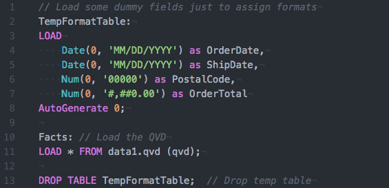

# language-qlik-view

Syntax Highlighting for QlikView and Qlik Sense .qvs files

> Converted from the Sublime Text highlighting https://github.com/kmpm/sublime-qvs

# Install
```shell
apm install language-qlik-view
```

# Example

